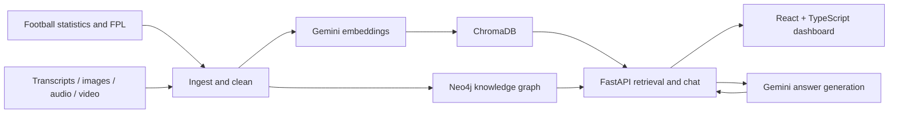

<div align="center">

# Premier League Knowledge Engine

**Explore football through connected statistics, media, and AI-assisted analysis.**


A full-stack prototype combining a football knowledge graph, multimodal embedding pipelines, and retrieval-augmented chat. The configured scope is **Aston Villa and Liverpool, 2025–26**.

[Experience](#experience) · [Architecture](#architecture) · [Engineering highlights](#engineering-highlights) · [Run locally](#run-locally) · [Code map](#code-map)

</div>

## Overview

Match statistics explain what happened; podcasts and other media add context. This project brings both into a shared analysis workflow: structured football data lives in Neo4j, embedded content lives in ChromaDB, and a React dashboard exposes graph exploration, fixtures, and an AI chat interface.

## Experience

- **Explore the knowledge graph:** navigate season, team, player, match, and gameweek relationships, with dedicated player and match views.
- **Browse fixtures and statistics:** inspect match results and query player rankings by supported statistics.
- **Ask football questions:** combine semantic retrieval from text with graph-derived player and team statistics in Gemini-generated answers. Chat responses include retrieved source summaries.
- **Build a multimodal corpus:** ingestion and embedding modules support transcripts, statistics, images, podcast audio, and video highlights.

Example questions for a populated dataset:

> Who are the top scorers across Aston Villa and Liverpool?
>
> Compare Aston Villa and Liverpool's season statistics.
>
> What does the available podcast context say about Liverpool?

## Architecture



Neo4j provides explicit relationships and structured queries. ChromaDB provides cosine-similarity retrieval across modality-specific collections and a unified collection. The current chat endpoint retrieves **text** embeddings and adds graph context through keyword and player-name matching; it does not yet expose cross-modal retrieval in chat.

## Engineering highlights

| Area | Implementation |
| --- | --- |
| Data engineering | Separate ingestion, cleaning, embedding, and storage stages with individual CLI entry points. |
| Repeatable processing | File-based checkpoints track completed work; retry utilities handle transient failures. |
| Knowledge graph | Constraints and indexes, player appearances, fixture relationships, and parameterized graph queries. |
| Vector storage | Persistent ChromaDB collections for text, images, audio, video, and unified embeddings; upserts use stable IDs. |
| Hybrid retrieval | Chat combines top text matches with structured graph context and a bounded history of eight messages. |
| Full-stack delivery | FastAPI endpoints serve a React/TypeScript dashboard with a force-directed graph, match browser, and chat. |

## Run locally

### 1. Prepare the backend

Prerequisites: Python 3.11+, Node.js with npm, a running Neo4j instance, and API credentials. Audio and video processing additionally require FFmpeg.

```bash
git clone https://github.com/jengaWiz/pl-knowledge-engine.git
cd pl-knowledge-engine
python3 -m venv .venv
source .venv/bin/activate
python -m pip install -e ".[dev]"
python -m pip install -r backend/requirements.txt
cp .env.example .env
```

If your pip/setuptools version rejects editable installation because this repository has multiple top-level packages, install the dependencies listed in `pyproject.toml` directly into the virtual environment. Package discovery configuration still needs to be made explicit.

Edit `.env` with your own values:

| Variable | Purpose |
| --- | --- |
| `GEMINI_API_KEY` | Embedding and chat generation. |
| `YOUTUBE_API_KEY` | Podcast discovery through YouTube Data API. |
| `BALLDONTLIE_API_KEY` | EPL statistics ingestion. |
| `NEO4J_URI`, `NEO4J_USER`, `NEO4J_PASSWORD` | Graph database connection. |

Settings require the three API keys and Neo4j password at import time, including when starting only the backend. Model names can be overridden with `GEMINI_MODEL` and `GEMINI_TEXT_MODEL`; select models available to your account and keep embedding dimensions consistent between ingestion and queries.

### 2. Populate the stores

Run from the repository root with the virtual environment active. These stages call external services and may incur API usage charges.

```bash
python scripts/run_pipeline.py --stage ingest
python scripts/run_pipeline.py --stage clean
python scripts/run_pipeline.py --stage agent1
python scripts/run_pipeline.py --stage embed
python scripts/run_pipeline.py --stage store
python scripts/run_pipeline.py --stage graph
```

Running stages separately makes failures easier to inspect. The all-in-one runner logs failed stages and continues, so a final completion message alone does not establish successful ingestion. Generated data and local stores are excluded from version control; a fresh clone starts without a populated dataset.

Optional media preparation scripts are `scripts/run_agent2.py` (audio), `scripts/run_agent3.py` (images), and `scripts/run_agent4.py` (video). Run relevant media preparation before embedding to include those assets.

### 3. Start the API and dashboard

From the repository root:

```bash
python -m uvicorn backend.main:app --reload --port 8000
```

In a second terminal:

```bash
cd frontend
npm ci
npm run dev
```

Open **http://localhost:5173** for the dashboard or **http://localhost:8000/docs** for the API explorer. Vite proxies `/api` requests to port 8000.

## API at a glance

| Method | Route | Purpose |
| --- | --- | --- |
| `GET` | `/api/graph/overview` | Season overview nodes and edges. |
| `GET` | `/api/graph/player/{web_name}` | Player-centered subgraph. |
| `GET` | `/api/graph/match/{match_id}` | Match-centered subgraph. |
| `GET` | `/api/stats/top-players` | Rankings with team, stat, and limit filters. |
| `GET` | `/api/matches` | Stored fixtures and results. |
| `POST` | `/api/chat` | Generated reply and retrieved source summaries. |
| `GET` | `/api/health` | API liveness; does not verify external dependencies. |

## Code map

| Path | Responsibility |
| --- | --- |
| [src/ingest/](src/ingest/) | Statistics, FPL, YouTube transcripts, and media ingestion. |
| [src/clean/](src/clean/) | Data cleanup, statistical summaries, transcript chunks, and audio segments. |
| [src/embed/](src/embed/) | Gemini client and embedding pipelines. |
| [src/store/](src/store/) | ChromaDB collections and Neo4j operations. |
| [src/utils/](src/utils/) | Checkpoints, retry handling, and structured logging. |
| [backend/main.py](backend/main.py) | Graph, statistics, fixture, and chat endpoints. |
| [frontend/src/](frontend/src/) | Dashboard components, API client, and types. |
| [scripts/](scripts/) | Stage runners and graph initialization. |
| [tests/](tests/) | Ingestion, cleaning, embedding, and vector-store tests. |

## Development checks

```bash
python -m pytest tests/ -v
ruff check src/ tests/
ruff format --check src/ tests/
cd frontend
npm run build
```

The root `conftest.py` provides dummy environment values for tests. Live API calls and database integrations require separately configured services.

## Scope and next steps

This is a local development prototype. Data completeness depends on ingestion results, provider access, and the configured season; fresh FPL data may differ from the intended 2025–26 scope. There is no published benchmark or claim of production readiness.

Next steps include reproducible packaging and dependency locking, API authentication, stricter deployment configuration, retrieval quality evaluation, and exposing multimodal search through the API.

For deeper design context, see the [implementation guide](IMPLEMENTATION_GUIDE.md) and [graph improvement plan](GRAPH_IMPROVEMENT_PLAN.md). These documents include planning material; the source code defines current behavior.
