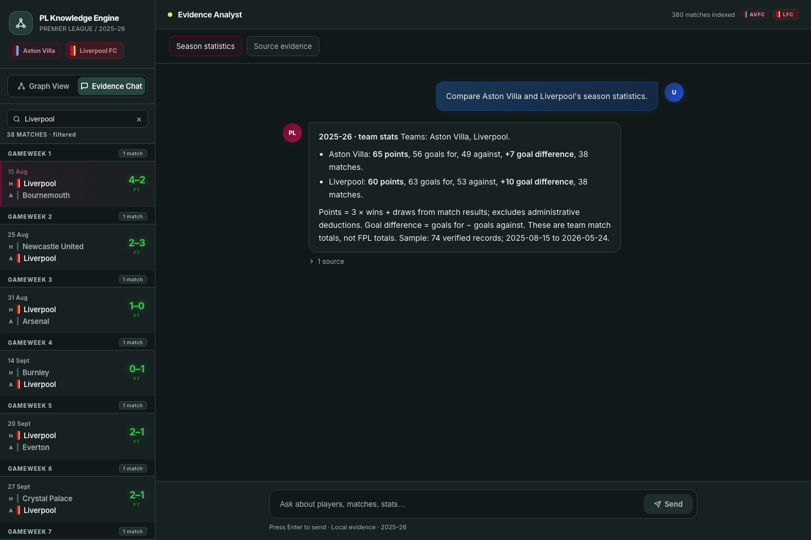
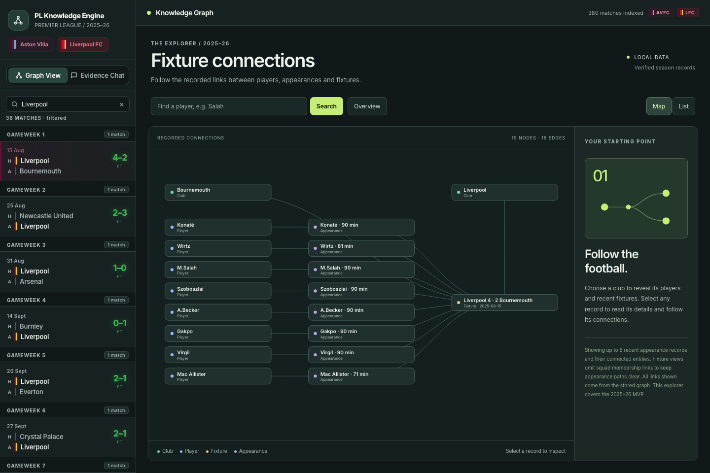
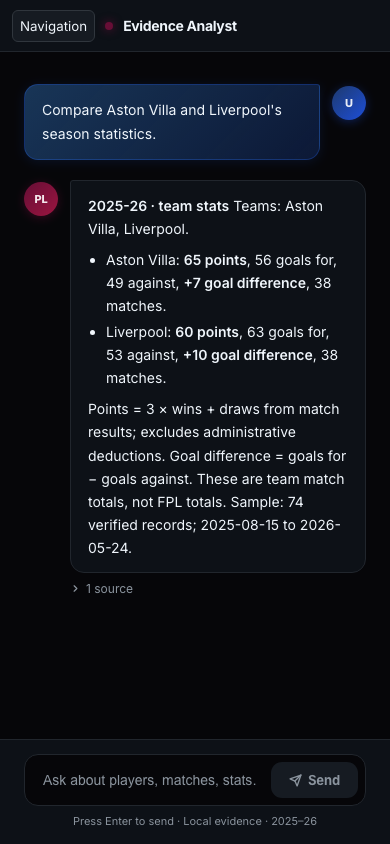
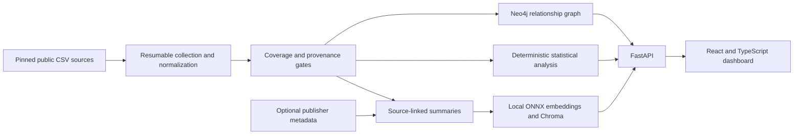

<div align="center">

# Premier League Knowledge Engine

**From public football data to connected evidence and reproducible answers.**


[](https://github.com/jengaWiz/pl-knowledge-engine/actions/workflows/ci.yml)

**380 matches · 20 clubs · 1,780 graph nodes · 457 searchable summaries**

[Demo](#demo) · [Quick start](#quick-start) · [Architecture](#architecture) · [Validation](#validation) · [Scope](#scope)

</div>

> [!IMPORTANT]
> **Why there is no public hosted demo: a deliberate choice to avoid recurring infrastructure costs.**
> The complete application is deployed locally with Docker: a non-root API/frontend image, persistent Neo4j and Chroma storage, loopback networking, health/readiness checks and verified backup/restart workflows. Public hosting would add ongoing compute and database costs. You can run the same populated demo without a cloud account or paid API keys. [Deployment and operations guide](docs/local-demo.md).

## What it does

The engine collects historical Premier League data from public sources, verifies its provenance and coverage, then makes it explorable through a React dashboard. Neo4j connects clubs, fixtures and player appearances; Chroma indexes source-linked summaries using a local CPU embedding model.

The evidence analyst calculates supported statistics from verified records. Each answer includes its season, sample size, metric definitions and source references. Unsupported predictions, causal explanations and unavailable commentary receive an explicit insufficient-evidence response.

The [fresh-data MVP milestone](https://github.com/jengaWiz/pl-knowledge-engine/milestone/1) is complete: **all 10 implementation tickets are closed**.

## Demo



- **Evidence analyst:** compare points, goals and goal difference; inspect last-five form, home/away splits and goal/assist rankings, including per-90 rates with a minutes threshold.
- **Connected graph:** explore season, club, gameweek, fixture and player relationships, with player search and match views.
- **Fixture browser:** filter the full league schedule and navigate results using mouse or keyboard.
- **Evidence retrieval API:** search local summaries by club and inspect source URLs, record IDs and provenance.

<details>
<summary>See the match graph and mobile experience</summary>





</details>

These are screenshots of the populated application, captured with [Playwright](frontend/scripts/capture-demo.mjs).

Try these questions:

> Compare Aston Villa and Liverpool's season statistics.
>
> Who are Liverpool's top scorers this season?
>
> Which players score most per 90 with at least 450 minutes?

## Quick start

Prerequisites: Docker with Compose running, Python **3.11 or newer** for the launcher, and internet access for the initial build and public data/model downloads.

```bash
git clone https://github.com/jengaWiz/pl-knowledge-engine.git
cd pl-knowledge-engine
python3 scripts/demo.py
```

Open **http://127.0.0.1:8010** when the launcher reports ready. Interactive API docs are at **http://127.0.0.1:8010/docs**.

The command starts from empty storage, collects pinned sources, validates the corpus, loads the graph and vector index, and runs the numerical acceptance gate. It creates private database credentials automatically and persists data across restarts. Gemini and YouTube API keys are disabled in this deployment.

Allow several minutes for the first run, at least 4 GB of Docker memory and several GB of available disk. The local embedding-model archive is approximately 80 MB; later runs reuse verified downloads and the model cache.

```bash
python3 scripts/demo.py status  # verify corpus, graph, index and cached model
python3 scripts/demo.py stop    # stop only this project; keep its data
python3 scripts/demo.py backup  # consistent private backup, then restart
```

If Docker Desktop's credential helper stalls before the build starts, use `python3 scripts/demo.py --public-images`. This tested option uses a temporary client configuration while preserving your existing Docker login and context.

See the [operations guide](docs/local-demo.md) for recollection, attribution, storage, ports, backup and explicit reset instructions.

## Architecture



Numerical answers come from deterministic calculations. Semantic retrieval uses the same pinned, 384-dimensional `all-MiniLM-L6-v2` model for documents and queries. Publisher metadata is separate from statistical evidence.

| Engineering decision | Why it matters |
| --- | --- |
| Pinned source contracts and checksums | Detect changed inputs and preserve source identity. |
| Atomic writes, bounded retries and checkpoints | Recover from interrupted collection without silently accepting partial data. |
| Coverage, join and provenance gates | Reject incomplete or inconsistent mandatory inputs before loading stores. |
| Fixture-based player attribution | Handle transfers using the club in each match; keep cumulative FPL snapshots separate. |
| Versioned graph and vector collections | Detect stale stores and incompatible embedding metadata. |
| Independent raw-CSV numerical oracle | Validate answers against a separate SQLite calculation. |
| Persistent Docker deployment | Reproduce collection, loading and serving without paid infrastructure. |
| Separate liveness and readiness | A responsive API only reports ready when verified data and stores are available. |

## Validation

Verified against pinned **2025–26** sources. [Acceptance evidence and reproduction steps](docs/mvp-acceptance.md).

| Check | Result |
| --- | --- |
| Python suite | **359 tests passed**; CI covers Python 3.11 and 3.12. |
| Independent numerical references | **42/42 passed**, plus five insufficient-evidence cases. |
| Real-store/API acceptance | **Seven checks passed**, including all 42 live numerical references. |
| Desktop/mobile browser flows | **8/8 passed** against the Docker-served production dashboard. |
| Empty-storage Docker setup | Public collection, validation, graph/index loading and readiness passed. |
| Backup and restart | All four volumes backed up privately; versions, counts and live answers preserved without recollection. |
| CI | Python checks, wheel packaging, frontend build, Docker build and cold-storage readiness checks. |

Generated data, model files, credentials and local reports are excluded from Git. A fresh clone collects its own corpus.

## Scope

| Dataset | Verified coverage |
| --- | --- |
| Season | **2025–26**, match dates 15 August 2025 through 24 May 2026. |
| Match results | **380 fixtures**, all **20 clubs**, 38 matches per club. |
| Detailed players | **Aston Villa and Liverpool**: 57 players, 1,284 appearance records; 1,162 with positive minutes. |
| Knowledge graph | **1,780 nodes** covering season, clubs, gameweeks, fixtures, players and appearances. |
| Local retrieval | **457 source-linked statistical summaries**. |
| External commentary | Discovery found **zero usable season-dated items**; statistical evidence remains the fallback. |

Sources include [Football-Data](https://www.football-data.co.uk/) and [FPL-Core-Insights](https://github.com/olbauday/FPL-Core-Insights). [Source contracts and attribution](docs/data-sources.md) document the pinned archive revision, URLs, checksums and usage terms.

Quality reports disclose one conflicting score, five team goals unattributed to player records and unavailable bench statistics. Primary match results determine team deductions; missing values remain unknown.

Broader seasons and player coverage, public hosting with authentication, production hardening and exposed multimodal retrieval remain future work. Separate legacy media/provider pipelines exist in the repository and may require FFmpeg or billed provider credentials.

## Development

An [optional historical match collector](docs/historical-match-corpus.md) prepares **1,140 additional match documents** from three complete Premier League seasons (2022–23 through 2024–25). [Structured evidence acceptance](docs/structured-evidence-acceptance.md) combines them with the 2025–26 text into **2,682 verified structured/text documents** across four seasons, meeting the preparation target. These artifacts are not yet embedded or loaded into the demo graph; media collection is optional.

An [optional public-media collector](docs/public-media-collection.md) downloads reviewed, licensed image/audio/video samples with checksum, attribution and decoding checks. These are background assets; bounded extraction prepares 106 verified media documents. [Statistical text preparation](docs/statistical-text-documents.md) adds 1,542 source-backed match and appearance documents. [Combined corpus acceptance](docs/multimodal-acceptance.md) verifies **1,648 prepared documents** across all four modalities, from 120 original source files. This optional four-modality corpus remains below its own 2,500-document target; it is separate from the structured preparation target above and is not yet embedded or exposed through the demo index.

<details>
<summary>Native setup and checks</summary>

Use Python 3.11 or 3.12, uv, Node.js 22.12+ and a configured local Neo4j instance. Set `NEO4J_URI`, `NEO4J_USER` and `NEO4J_PASSWORD` in `.env` before loading the graph. The default analyst needs no paid provider keys.

```bash
uv sync --locked --extra dev
cp .env.example .env
# Configure local Neo4j in .env, then:
uv run --locked python scripts/run_mvp.py --commentary
uv run --locked python scripts/load_mvp.py
uv run --locked python scripts/accept_mvp.py
uv run --locked python -m uvicorn backend.main:app --reload --port 8000
```

In another terminal:

```bash
cd frontend
npm ci --ignore-scripts
npm run dev
```

Open **http://localhost:5173**. Vite proxies `/api` to port 8000.

```bash
# From the repository root:
make test
make lint
cd frontend
npm run build
```

For browser and real-store checks, follow [acceptance reproduction](docs/mvp-acceptance.md). Optional notebook dependencies use `uv sync --locked --extra dev --extra notebooks`. The backend currently supports Python 3.11/3.12; the standalone Docker launcher also works on newer Python versions.

</details>

| Code | Responsibility |
| --- | --- |
| [src/ingest/](src/ingest/) | Public collection, source verification and normalization. |
| [src/clean/corpus_quality.py](src/clean/corpus_quality.py) | Coverage, joins, integrity and provenance gates. |
| [src/analysis/](src/analysis/) | Supported deductions and evidence-backed answers. |
| [src/store/](src/store/) | Managed graph and local vector-index loading/search. |
| [backend/](backend/) | Graph, fixture, analysis, retrieval and readiness APIs. |
| [frontend/src/](frontend/src/) | Responsive graph, fixture browser and evidence analyst. |
| [scripts/](scripts/) | Collection, acceptance and deployment entry points. |
| [tests/](tests/) | Regression tests and independent numerical references. |

Design history: [implementation guide](IMPLEMENTATION_GUIDE.md) and [graph improvement plan](GRAPH_IMPROVEMENT_PLAN.md). These include planning material; the implemented MVP and acceptance evidence define current behavior.
