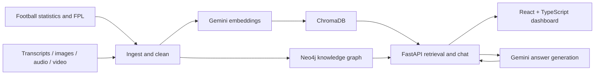

<div align="center">

# Premier League Knowledge Engine

**Explore football through connected statistics, media, and AI-assisted analysis.**


A full-stack prototype combining a football knowledge graph, multimodal embedding pipelines, and retrieval-augmented chat. The configured scope is **Aston Villa and Liverpool, 2025–26**.

[Experience](#experience) · [Architecture](#architecture) · [Engineering highlights](#engineering-highlights) · [Run locally](#run-locally) · [Code map](#code-map)

</div>

## Overview

Match statistics explain what happened; podcasts and other media add context. This project brings both into a shared analysis workflow: structured football data lives in Neo4j, embedded content lives in ChromaDB, and a React dashboard exposes graph exploration, fixtures, and an AI chat interface.

## Experience

- **Explore the knowledge graph:** navigate season, team, player, match, and gameweek relationships, with dedicated player and match views.
- **Browse fixtures and statistics:** inspect match results and query player rankings by supported statistics.
- **Ask football questions:** combine semantic retrieval from text with graph-derived player and team statistics in Gemini-generated answers. Chat responses include retrieved source summaries.
- **Build a multimodal corpus:** ingestion and embedding modules support transcripts, statistics, images, podcast audio, and video highlights.

Example questions for a populated dataset:

> Who are the top scorers across Aston Villa and Liverpool?
>
> Compare Aston Villa and Liverpool's season statistics.
>
> What does the available podcast context say about Liverpool?

## Architecture



Neo4j provides explicit relationships and structured queries. ChromaDB provides cosine-similarity retrieval across modality-specific collections and a unified collection. The current chat endpoint retrieves **text** embeddings and adds graph context through keyword and player-name matching; it does not yet expose cross-modal retrieval in chat.

## Engineering highlights

| Area | Implementation |
| --- | --- |
| Data engineering | Separate ingestion, cleaning, embedding, and storage stages with individual CLI entry points. |
| Repeatable processing | File-based checkpoints track completed work; retry utilities handle transient failures. |
| Knowledge graph | Constraints and indexes, player appearances, fixture relationships, and parameterized graph queries. |
| Vector storage | Persistent ChromaDB collections for text, images, audio, video, and unified embeddings; upserts use stable IDs. |
| Hybrid retrieval | Chat combines top text matches with structured graph context and a bounded history of eight messages. |
| Full-stack delivery | FastAPI endpoints serve a React/TypeScript dashboard with a force-directed graph, match browser, and chat. |

## Run locally

### 1. Prepare the backend

Prerequisites: Python 3.11 or 3.12, uv, Node.js with npm, a running Neo4j instance for graph operations, and optional provider credentials. Audio and video processing additionally require FFmpeg.

```bash
git clone https://github.com/jengaWiz/pl-knowledge-engine.git
cd pl-knowledge-engine
uv sync --locked --extra dev
cp .env.example .env
```

Python dependencies are locked in `uv.lock`, with explicit package discovery. Python
3.12 is the default; 3.11 is also tested. Audio processing currently relies on
`audioop`, so Python 3.13+ is not supported yet. Notebook dependencies are optional:
`uv sync --locked --extra dev --extra notebooks`.

Public historical source checks require **no API keys or database**:

```bash
uv run --locked python scripts/check_sources.py
```

This downloads pinned 2025–26 source snapshots to `data/raw/source_checks/` and
writes `data/reports/source_checks.json` with hashes, schemas, counts, attribution,
and available date evidence. It validates accessibility and source identity; it
does not yet normalize the corpus or populate the databases. Follow the
[MVP milestone](https://github.com/jengaWiz/pl-knowledge-engine/milestone/1) for the
remaining collection, loading, and deduction work. See [source contracts](docs/data-sources.md).

Collect the complete, validated match dataset:

```bash
uv run --locked python scripts/collect_matches.py
uv run --locked python scripts/collect_players.py
uv run --locked python scripts/check_corpus.py
```

The collector caches the pinned source, normalizes results and available match
statistics, and requires 380 unique fixtures across 20 teams with 38 matches per
team. Missing statistics remain null. It writes
`data/cleaned/mvp/2025-26/matches.jsonl` and a source-linked coverage report at
`data/reports/mvp/2025-26/matches.json`. Reruns validate the cache; `--refresh`
refetches the same pinned contract. The player collector then joins all 38 archived gameweeks to these canonical matches, attributes players through actual match lineups, and writes `players.jsonl`, `appearances.jsonl` and `players.json` coverage. Latest FPL season snapshots stay separate from discrete match statistics. Source score conflicts and unavailable bench statistics are disclosed in the report. The corpus quality gate checks recorded artifact hashes, identifiers, source references, appearance joins and player-goal totals against primary match scores. It writes machine-readable `quality.json` and readable `quality.md`; changed artifacts require revalidation. These collectors do not yet load the graph or dashboard.
Use `--output /path/to/data` to select persistent storage outside the checkout.

Configure credentials only for features you use:

| Variable | Required for |
| --- | --- |
| `SEASON` | Historical scope, default `2025-26`. Unknown source-contract seasons fail explicitly. |
| `GEMINI_API_KEY` | Optional Gemini embedding and generated chat. |
| `YOUTUBE_API_KEY` | Optional YouTube API discovery. |
| `NEO4J_URI`, `NEO4J_USER`, `NEO4J_PASSWORD` | Graph operations. |

The backend can import and serve liveness without provider keys. Operations that
need a credential validate it when invoked. Public source checks do not call paid
providers. Live FPL adapters reject dated records outside the configured season
and resolve focus-team IDs from source names rather than fixed IDs.

### 2. Populate the stores

The following legacy pipeline stages require separately populated compatible data and, for embedding, configured provider credentials. The archived MVP adapters are being implemented in the milestone above. A live FPL feed for another season will be rejected; it is not a historical-data fallback. Optional provider stages may incur API usage charges.

```bash
uv run --locked python scripts/run_pipeline.py --stage ingest
uv run --locked python scripts/run_pipeline.py --stage clean
uv run --locked python scripts/run_pipeline.py --stage agent1
uv run --locked python scripts/run_pipeline.py --stage embed
uv run --locked python scripts/run_pipeline.py --stage store
uv run --locked python scripts/run_pipeline.py --stage graph
```

Running stages separately makes failures easier to inspect. The all-in-one runner logs failed stages and continues, so a final completion message alone does not establish successful ingestion. Generated data and local stores are excluded from version control; a fresh clone starts without a populated dataset.

Optional media preparation scripts are `scripts/run_agent2.py` (audio), `scripts/run_agent3.py` (images), and `scripts/run_agent4.py` (video). Run relevant media preparation before embedding to include those assets.

### 3. Start the API and dashboard

From the repository root:

```bash
uv run --locked python -m uvicorn backend.main:app --reload --port 8000
```

In a second terminal:

```bash
cd frontend
npm ci
npm run dev
```

Open **http://localhost:5173** for the dashboard or **http://localhost:8000/docs** for the API explorer. Vite proxies `/api` requests to port 8000.

## API at a glance

| Method | Route | Purpose |
| --- | --- | --- |
| `GET` | `/api/graph/overview` | Season overview nodes and edges. |
| `GET` | `/api/graph/player/{web_name}` | Player-centered subgraph. |
| `GET` | `/api/graph/match/{match_id}` | Match-centered subgraph. |
| `GET` | `/api/stats/top-players` | Rankings with team, stat, and limit filters. |
| `GET` | `/api/matches` | Stored fixtures and results. |
| `POST` | `/api/chat` | Generated reply and retrieved source summaries. |
| `GET` | `/api/health` | API liveness; does not verify external dependencies. |

## Code map

| Path | Responsibility |
| --- | --- |
| [src/ingest/](src/ingest/) | Statistics, FPL, YouTube transcripts, and media ingestion. |
| [src/clean/](src/clean/) | Data cleanup, statistical summaries, transcript chunks, and audio segments. |
| [src/embed/](src/embed/) | Gemini client and embedding pipelines. |
| [src/store/](src/store/) | ChromaDB collections and Neo4j operations. |
| [src/utils/](src/utils/) | Checkpoints, retry handling, and structured logging. |
| [backend/main.py](backend/main.py) | Graph, statistics, fixture, and chat endpoints. |
| [frontend/src/](frontend/src/) | Dashboard components, API client, and types. |
| [scripts/](scripts/) | Stage runners and graph initialization. |
| [tests/](tests/) | Ingestion, cleaning, embedding, and vector-store tests. |

## Development checks

```bash
make test
make lint
cd frontend
npm run build
```

GitHub Actions runs offline tests and Python correctness checks on 3.11 and 3.12, builds a wheel, and verifies a clean frontend build. Strict style checks cover the new MVP foundation modules; legacy style cleanup remains separate. The root `conftest.py` supplies test credentials, and a subprocess regression verifies backend liveness without any provider keys. Live API calls and database integrations require separately configured services.

## Scope and next steps

This is a local development prototype. Data completeness depends on ingestion results, provider access, and the configured season; fresh FPL data may differ from the intended 2025–26 scope. There is no published benchmark or claim of production readiness.

The active MVP starts from empty storage: collect historical match/player data, verify provenance and coverage, populate the stores, and deliver evidence-backed deductions through a local demo. API authentication, broader deployment hardening, and exposing multimodal search remain future work.

For deeper design context, see the [implementation guide](IMPLEMENTATION_GUIDE.md) and [graph improvement plan](GRAPH_IMPROVEMENT_PLAN.md). These documents include planning material; the source code defines current behavior.
