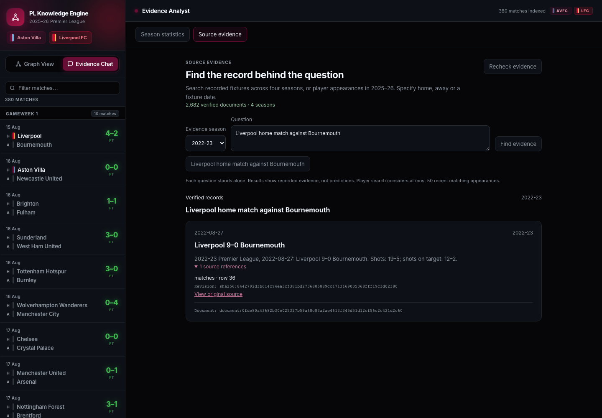

# Structured evidence in the analyst

Open **Evidence Chat → Source evidence** to search the accepted four-season corpus.
The existing **Season statistics** mode still calculates supported 2025–26 metrics.
The sidebar fixtures and graph continue to show the default 2025–26 MVP; the
Source evidence season selector controls historical retrieval independently.



## Prepare the optional stores

The default Docker launcher prepares the established MVP. Source evidence also
requires the optional historical corpus, accepted structured text, separate
vector index and evidence graph. From a configured checkout with the MVP ready:

```bash
uv run --locked python scripts/collect_history.py
uv run --locked python scripts/prepare_text.py
uv run --locked python scripts/accept_corpus.py --require-target
uv run --locked python scripts/index_evidence.py
uv run --locked python scripts/load_evidence_graph.py
```

For the Docker app, rebuild the image after pulling the changes and run these
scripts inside the app container so the named data/index/model volumes contain
the optional stores. The API's data directory and Neo4j target must be the same
ones used to prepare them. This optional preparation is not performed by the
existing default MVP launcher. The local model must be completely cached before
HTTP retrieval is enabled; preparation can download the public model if needed.
No paid provider calls or Gemini keys are required.

The [graph-constrained retrieval guide](graph-constrained-retrieval.md) documents
supported wording, canonical routing, candidate limits and store integrity.

## Interface

The panel checks evidence readiness when opened and offers **Recheck evidence**.
It lists only verified corpus seasons. Missing optional stores do not disable the
existing statistics mode or liveness endpoint. Source evidence stays disabled
until its own checks pass; it does not silently substitute the smaller MVP index.

Choose a season and ask, for example, `Liverpool home match against Bournemouth`.
`Liverpool vs Bournemouth` requests clarification and offers dated home fixtures
as follow-up buttons. Questions are independent; conversation context is not
inferred. Player appearance questions such as `Digne appearances against Liverpool`
use 2025–26 evidence. Unsupported and unavailable routes display their reason
without fabricated answers.

Cards show the fixture date and selected season, exact scores or player-team /
opponent / minutes context, verified document text, original source links and
row/revision references. Changing season clears the previous result. Busy or
failed retrieval preserves the question for retry. Desktop and mobile layouts
are checked for viewport overflow.

## API

- `GET /api/evidence/status`: independent structured-evidence readiness.
- `POST /api/evidence/retrieve`: graph-constrained retrieval with explicit season.
- Existing `/api/chat`, `/api/analysis` and `/api/evidence/search` retain the MVP scope.

```json
{
  "query": "Liverpool home match against Bournemouth",
  "evidence_season": "2022-23",
  "limit": 5
}
```

Queries contain 1–4,000 characters; result limits are strict integers from 1–20.
Unknown fields and invalid season formats are rejected with HTTP 422. The route
response retains `resolved`, `clarification`, `unsupported` or `unavailable` and
source-linked hits. Valid abstentions use HTTP 200. Store failures return HTTP 503
with a generic message; connection details and credentials are not exposed.
Concurrent optional evidence operations in one API worker receive HTTP 429 with
`Retry-After: 2`. Store locks also protect operations across processes.

Readiness reconstructs accepted sources, verifies the complete graph and vector
index, requires all six model/tokenizer cache files and rechecks the evidence hash.
It embeds no text and downloads no model. Retrieval requires that complete cache
before invoking the existing integrity-checked local pipeline.

## Verification and limits

The local live HTTP smoke passed readiness (2,682 documents / four seasons), a
historical 9–0 fixture, both Digne/Liverpool appearances, fixture clarification
and prediction abstention. A real browser retrieved that historical fixture and
opened its original source references. All 14 desktop/mobile browser checks passed,
including the existing MVP interactions; six isolated evidence checks also pass
against a static preview and run in GitHub CI.

Full integrity checks remain intentionally expensive: measured live readiness
was about 17 seconds; fixture/player retrieval about 10–12 seconds in this run.
The UI shows progress and allows retry. This is a verified local prototype, with
no production throughput claim, generated tactical advice, prediction model or
live Gemini integration. The earlier 16-case retrieval smoke remains a small
source-known evaluation, not a broad relevance benchmark.
